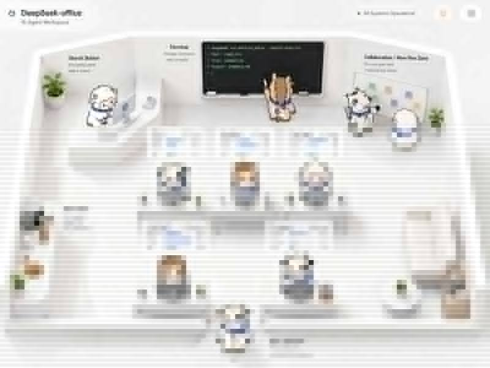

# DeepSeek-office 🏢🐮🐴🐑

把 DeepSeek Harness 里的 Agent 变成一群真的在办公室里上班的「牛马羊」。

每个会话 = 一个工位。Agent 大部分时间坐在自己的工位思考、读文件、改文件；需要联网、跑命令、拉 Subagent 或找你确认时，才会从工位起身走到办公室里的公共区域。



## 它会做什么

- **一个会话一个工位**：当前会话列表自动变成办公室里的员工与工位。
- **牛 / 马 / 羊随机员工**：员工物种由会话 ID 稳定分配；角色多起来后再用围巾 / 工牌主题色区分。
- **工位工作流摘要**：实时显示当前任务、正在阅读的文件、正在修改的文件、最近调用的工具与下一步。
- **Search Station**：`web_search` / `web_fetch` / browser 类工具会让员工跑到共享搜索台。
- **Terminal 黑板**：`bash` / `pwsh` / terminal / test / build / git 等工具会让员工跑到黑板前。
- **Collaboration 区**：Subagent / spawn / fork / delegate 类动作会让员工去协作区「叫同事」。
- **Boss / Approval**：当 Harness 在等用户输入或审批时，员工会一路往屏幕下方走，抬头来找你。
- **随机摸鱼**：空闲员工偶尔去 Coffee & Snacks 区喝咖啡、吃零食；不会所有人一直乱跑。
- **报错与完成动画**：错误会抱头抖动，完成会举手庆祝和撒花。
- **真实走动过渡**：Agent 从工位切换到公共区或返回工位时，会进入 walking pose，再切换到目的地动作。
- **点击员工 / 工位卡片即可打开真实会话**。

## 角色定稿

| 牛 | 马 | 羊 |
|---|---|---|
|  |  |  |

产品 UI 中使用同一套视觉规则重新绘制为轻量 SVG，这样可以实时换配色、做动作和移动动画；上面的三张图是角色视觉锚点。

角色运行时共用 8 个 pose：`idleDesk`、`thinking`、`walking`、`tool`、`break`、`approval`、`error`、`completed`。不需要为每种动物维护一整套 PNG 状态图。

## 状态映射

| Harness 状态 / 行为 | DeepSeek-office 表现 |
|---|---|
| idle | 工位摸鱼；少量随机进入 Break Zone |
| running / thinking | 回工位坐下工作 |
| read / grep / glob / edit / write | 留在工位，通过摘要卡体现文件读写 |
| web_search / web_fetch | Search Station |
| bash / pwsh / terminal / test / build | Terminal 黑板 |
| subagent / spawn / fork | Collaboration |
| pending interaction / ask user | Boss / Approval，面向屏幕外的你 |
| recent error | 工位抱头 + 红色错误状态 |
| completed | 工位庆祝 / 撒花 |

设计原则：**工位是主场，公共区是办事点。** Agent 不会因为每一个小工具调用都起身跑一圈。

## 安装（源码 / GitHub）

DeepSeek Harness 当前的插件机制是 profile bundle。仓库通过 `package.json` 中的 `dsh.bundle` 配置和 `cordis.patch.yml` 挂载插件。

### 本地 checkout

```bash
git clone https://github.com/yinhong-zhou/Deepseek-officeUI.git
cd Deepseek-officeUI
pnpm install
pnpm build

dsh plugin --profile demo add .
dsh --profile demo web
```

### 直接从 GitHub 安装

```bash
dsh plugin --profile demo add github:yinhong-zhou/Deepseek-officeUI
```

DeepSeek Harness 使用 pnpm ≥ 10 时，Git 依赖的 `prepare` 默认需要显式授权。第一次安装如果提示 build 被阻止，请按 dsh / pnpm 输出，把这个包加入对应 profile 的 `pnpm-workspace.yaml`：

```yaml
allowBuilds:
  deepseek-office: true
```

然后重新执行 `dsh plugin ... add`。

## 开发

```bash
pnpm install
pnpm typecheck
pnpm build
```

项目结构：

```text
src/
├── index.ts                 # Host 端：刻意保持 no-op，避免重复维护 Session 状态
└── client/
    ├── index.tsx            # 浏览器插件入口 / Overlay 挂载
    ├── OfficeApp.tsx        # 办公室 UI、工位、公共区域、实时订阅
    ├── Animal.tsx           # 牛马羊 SVG 角色与 8 状态 pose
    ├── model.ts             # Harness Session -> 办公室状态映射
    └── Office.module.css    # 2.5D 视觉、布局、移动与状态动画
```

## 数据来源

DeepSeek-office **不自己维护第二份 Agent 状态**。浏览器端直接订阅 DSH 的 `sessions.list` 与每个 `SessionFace` 的 `ConversationSnapshot`，使用其中的：

- `running`
- `runningCalls`
- `nodes`
- `pending`
- `lastAgentError`
- Session summary 的 `completed` / `pendingInteraction` / `origin` / `parentId`

因此工作流摘要和空间行为来自真实 Harness 会话，而不是演示数据。

## 当前限制

- 为保证办公室画面不拥挤，主场景同时展示最近 / 最活跃的 **6 个工位**；更多会话会在顶部显示 off-screen 数量。
- DeepSeek Harness 仍处于 Developer Preview，插件 API 可能发生 breaking changes；项目会优先跟进官方最新版本。
- 工具名称是开放集合，当前通过代表性工具族映射公共区域；未知工具默认留在工位，不会让员工乱跑。

## License

MIT
